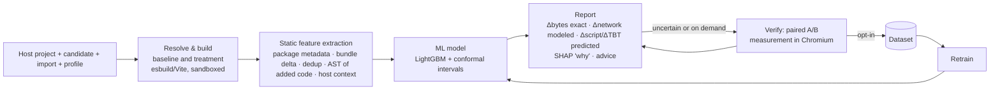

# 01 — Project Definition

**Working name:** DepLens — *context-aware prediction of the browser runtime cost of npm dependencies*
(rename freely; "DepLens" is only a placeholder used across these docs)

**One-line summary:** Before you add an npm package to your web app, DepLens tells you how much extra main-thread time, blocking time and bytes *your* app will pay for it — with an uncertainty range, an explanation, and cheaper alternatives — and lets you verify the prediction with a real browser measurement in one click.

---

## 1. The problem, stated precisely

Frontend developers add npm packages constantly (dates, charts, animation, validation, UI kits). The pre-install question they ask is: *"What will this cost my users?"*

Today they can answer only part of it:

| What exists today | What it tells you | What it cannot tell you |
|---|---|---|
| Bundlephobia / npmx | Size of the **whole** package (min + gzip), install size | What *your* imports cost after tree-shaking; anything about CPU time; anything about *your* app |
| bundlejs | Tree-shaken size of the exports you name | CPU time; overlap with deps you already ship |
| Import Cost (VS Code) | Size of each import line | CPU time; context |
| size-limit `/time`, estimo | Measured parse/compile/execute time in headless Chrome | Only **after** you integrate and build; results are noisy by the tools' own admission; no prediction for alternatives you have not installed |
| Lighthouse / Lighthouse CI / RelativeCI / Codecov bundle analysis | Whole-page metrics or bundle diffs | Only **after** the change is built/deployed; the package's share is not isolated |

Bytes are a weak proxy for runtime cost. The compressed size drives network time; the *uncompressed* code drives parse/compile/evaluate time, and even that is "not a perfect predictor" (Nolan Lawson, *JavaScript performance beyond bundle size*). V8 lazily pre-parses functions that are not called at load, so two packages of equal size can cost very different CPU time depending on how much work runs at module top level (V8 blog, *Blazingly fast parsing, part 2: lazy parsing*).

And the cost of a package is **not a property of the package alone**. It depends on the host app:

1. **Tree-shaking of the exact imports** — `import { format } from 'date-fns'` ≠ `import * as dfns from 'date-fns'`.
2. **Shared dependencies** — if the app already ships React, `react-dom`, `d3-*`, `tslib` or `@babel/runtime`, a package that depends on them costs less *in that app*.
3. **Where the code lands** — in the initial chunk (blocks load) or in a lazy chunk (cost moves to first interaction).
4. **Task merging** — Total Blocking Time is thresholded (the part of each main-thread task above 50 ms). Adding 30 ms of evaluation to an existing 40 ms task adds 20 ms of TBT; the same 30 ms in an empty page adds 0 ms. So ΔTBT is inherently context-dependent even when ΔCPU is not.

So today the only way to know the real impact is: install → integrate → build → benchmark repeatedly (because single runs are noisy). Developers rarely do that for each candidate, and never for five alternatives.

## 2. Our formulation (the research core)

We define the **incremental (marginal) cost** of a dependency:

> ΔC_m(H, P, I, D) = C_m(H ⊕ I_P) − C_m(H)

| Symbol | Meaning |
|---|---|
| **H** | Host app — the developer's existing app (or a benchmark host app in our dataset) |
| **P** | Candidate package + version, e.g. `date-fns@4.1.0` |
| **I** | Import spec — the exact import statement(s) the developer intends to add. Default = namespace import (upper bound). |
| **D** | Device/network profile, e.g. *mid-tier mobile*: CPU slowdown relative to a calibrated host + "Slow 4G" network (150 ms RTT, 1.6 Mbps down — Lighthouse's default mobile preset) |
| **m** | Metric (see §4) |
| **H ⊕ I_P** | The host app with the import injected into its entry module and the imported bindings kept alive (so tree-shaking cannot delete them) |

We also define the **isolated cost** C_iso(P, I, D) = the cost of the same import on an empty page. This is what package-centric tools approximate. The **context effect** is ΔC − C_iso. Measuring how large and how frequent the context effect is — and whether it can be predicted — is a first-class research question, not an assumption.

**The research question** (refined from the pitch):

> Can the incremental browser-runtime cost of adding an npm dependency to a specific web app be predicted *before running it in a browser*, from static information about the package, the exact imports and the host app — accurately enough to (a) beat size-based proxies, (b) rank alternatives correctly, and (c) flag performance-budget violations — and how much measurement effort does a predict-then-verify workflow save?

"Before running it in a browser" is important and deliberately precise: we **do** allow a cheap production build (1–10 s with esbuild/Vite). Everything computed from source, the lockfile and the build output counts as *static*. We **do not** execute the page. This is honest about what the tool actually does and it lets us use exact in-context byte deltas, which a naive "static features of the package" design would miss.

## 3. Inputs

### 3.1 User-facing tool (DepLens app / CLI)

| Input | Required | Form | Notes |
|---|---|---|---|
| Host project | yes | **Quick mode:** `package.json` + lockfile (npm/pnpm/yarn). **Full mode:** repo archive / Git URL / local dir via CLI, must build with Vite (MVP) | Quick mode never uploads source code; context = installed dependency graph + framework detection. Full mode builds the app and gives exact byte deltas. |
| Candidate package(s) | yes | name, optional version/range | 1 to 5 candidates (compare mode) |
| Import spec per candidate | recommended | code, e.g. `import { format, parseISO } from 'date-fns'` | Default: namespace import (upper bound). The UI offers "typical import" presets mined from README examples. |
| Profile | yes (default *mid-tier mobile*) | preset: desktop / mid-tier mobile / low-end mobile | Presets are calibrated slowdown factors, see doc 07 |
| Budget | optional | ms of main-thread time and/or KB (brotli) | Drives the verdict and risk level |
| Placement | optional | `initial` (default) or `lazy` | "What if I load it with `import()`?" |

### 3.2 Research pipeline (offline)

| Input | Form |
|---|---|
| Package corpus | 200–400 (target 350) browser-compatible npm package versions, stratified by category, size and module format, with 2 import scenarios each (full, typical) — doc 07 §6 |
| Host apps | 8–15 (target 12) buildable apps: Vite templates across frameworks + real open-source apps (e.g., RealWorld "Conduit" front-ends, TodoMVC variants) + synthetic heavy-baseline variants — doc 07 §5 |
| Profiles | 1 primary profile for all cells + 1–2 secondary profiles on a subset |

## 4. Outputs

### 4.1 Metrics we report (and which ones are learned)

| Metric | Definition | How obtained in the tool | Label for ML? |
|---|---|---|---|
| **ΔBytes** (min / gzip / brotli) | Change in shipped JS for the initial load | **Computed exactly** from the build (Full mode) or estimated from an isolated build + lockfile dedup (Quick mode) | No — deterministic |
| **ΔNetwork (ms)** | Extra transfer time under the profile's network | **Modeled** analytically from ΔBrotli bytes, throughput and RTT (doc 07 §4.6) | No — analytic |
| **ΔScript (ms)** — *primary* | Extra main-thread time in script parse/compile + evaluation + GC during load, under the profile's CPU | **Predicted** (ML) with an 80%/90% interval; **measured** on "Verify" | **Yes (primary target)** |
| **ΔTBT (ms)** | Extra blocking time (sum over main-thread tasks of time above 50 ms) in the load window | **Predicted** — both by ML and by an analytic task-merging model (doc 08 §7) | Yes (secondary) |
| ΔCompile / ΔEval / ΔGC | Breakdown of ΔScript | Predicted as separate heads (stretch) or shown only when measured | Secondary |
| ΔLCP (ms) | Change in Largest Contentful Paint | Only for client-side-rendered hosts where LCP waits on JS; shown as "measured only" | Secondary, subset |
| ΔJS heap (MB) | Extra JS heap after load | Measured on Verify | Secondary |
| ~~ΔINP~~ | — | **Not predicted.** INP needs real user interactions; a lab harness with synthetic clicks would produce a label that reflects our script, not users. We state this as a limitation. | No |

### 4.2 The report the developer sees (per candidate)

```json
{
  "candidate": { "name": "date-fns", "version": "4.1.0", "import": "import { format } from 'date-fns'" },
  "profile": "mid-tier-mobile",
  "bytes":   { "min": 17340, "gzip": 5120, "brotli": 4610,
               "newPackages": [], "sharedWithApp": [] , "exact": true },
  "network": { "ms": 23, "model": "slow-4g: 1.6 Mbps, 150 ms RTT, same chunk" },
  "script":  { "point": 11.8, "p10": 7.9, "p90": 17.5, "source": "predicted" },
  "tbt":     { "point": 0,    "p10": 0,   "p90": 6,    "source": "predicted" },
  "budget":  { "scriptMs": 50, "verdict": "within" },
  "risk":    "low",
  "why": [
    { "text": "Adds 17 KB of minified code to your initial bundle", "ms": 6.1 },
    { "text": "Only 2% of the package survives tree-shaking for this import", "ms": -4.0 },
    { "text": "Little code runs at module top level (0 eager calls)", "ms": -1.2 }
  ],
  "advice": [
    { "type": "native", "text": "Intl.DateTimeFormat covers this use case with zero added bytes" }
  ],
  "model": { "version": "lgbm-2027-01-10", "trainedOnCells": 5230, "withinNoiseRate": 0.71 }
}
```

`risk` is derived from the interval, not the point estimate: **low** if p90 < 50% of budget, **high** if p10 > budget, **uncertain → verify recommended** if the interval straddles the budget, **moderate** otherwise.

## 5. How we tackle it — end-to-end



1. **Resolve & build (deterministic).** Install the host's dependencies with `--ignore-scripts` in a sandbox, build a baseline and a treatment bundle. The treatment differs *only* by the injected import and a "sink" that keeps the imported bindings alive. Output: exact Δbytes, the list of added modules, which packages were new vs already present.
2. **Static features.** Five groups (full list in doc 08 §3): package metadata; isolated bundle features; in-context delta features (bytes, new vs shared packages, duplicate versions); code-structure features of *only the added code* (top-level calls, eager-compiled function patterns, large literals, DOM/layout API use, polyfill signals…); host context (framework, baseline size).
3. **Prediction.** Gradient-boosted trees (LightGBM) predict ΔScript and ΔTBT under the profile, with conformalized quantile intervals, trained on our measured dataset.
4. **Explain & advise.** TreeSHAP contributions become plain-English reasons. Deterministic advisors add: cheaper import form, lazy-load option, known lighter or native replacements (e18e module-replacements data).
5. **Verify (predict-then-verify).** One click (or automatically when the interval straddles the budget) runs the real paired A/B measurement in headless Chromium (doc 07) and shows measured vs predicted.
6. **Learn.** Verified measurements (opt-in) enrich the dataset.

## 6. Research questions and hypotheses

| RQ | Question | Hypothesis / what would falsify it |
|---|---|---|
| **RQ1 Measurement & context** | How precisely can incremental dependency cost be measured in a lab, and how large and frequent is the context effect (ΔC vs C_iso)? | H1: the context effect exceeds the measurement noise floor for a meaningful share (≥20%) of package–host cells, driven mostly by shared dependencies and TBT task merging. *Falsified if* ΔC ≈ C_iso within noise for almost all cells → drop "context-aware" from the headline, keep it as a finding. |
| **RQ2 Size as a proxy** | How well do size-based proxies predict runtime cost — whole-package size (Bundlephobia-style), import-aware size (bundlejs-style), in-context Δbytes? | H2: whole-package size is a poor predictor (ρ < 0.6); in-context Δbytes is strong for parse/compile but weaker for evaluation. |
| **RQ3 Prediction** | Does a model over static + context features beat the size proxies on **unseen packages** and **unseen host apps**? Does adding a cheap isolated measurement (hybrid) help? | H3: lower error than the strongest size baseline (in-context Δbytes), statistically significant (Wilcoxon, Holm-corrected), on grouped splits. *Falsified if* it does not beat in-context Δbytes → the paper becomes "size is (not) enough" and the tool ships the simpler model. |
| **RQ4 Decision utility** | Does the model rank alternatives correctly and flag budget violations? How much measurement does predict-then-verify save for a target accuracy? | H4: pairwise ranking accuracy on significant pairs ≥ 80%; verifying only the most uncertain 20–30% of cases recovers most of the accuracy of measuring everything. |
| **RQ5 Explanation** | Which characteristics drive dependency runtime cost? | Descriptive (SHAP), cross-checked against V8 documentation (lazy parsing, eager-compile heuristics). |

## 7. Scope

**In scope:** client-side JavaScript packages from npm that run in a browser; load-time cost (download + parse/compile + top-level evaluation + GC) with the import in the initial chunk (plus a lazy-chunk variant); Chromium; Vite/Rollup/esbuild builds; lab (synthetic) measurement with CPU/network emulation.

**Out of scope (explicitly):**
- *Usage-time* cost (what happens when you call `chart.render(10_000 points)`). It depends on inputs and cannot be statically predicted in general. We measure a minimal-usage scenario only for a small curated subset, as future-work evidence.
- INP and other interaction metrics (see §4.1).
- Server-side / Node.js performance, SSR cost, edge runtimes.
- Firefox/Safari engines. webpack-specific builds (MVP), Next.js/Angular CLI builds (MVP).
- Security, licensing, maintenance scoring — other tools do these well (npmx, Snyk, e18e).

## 8. What "better" means — and where we are honestly *not* better

| Capability | Bundlephobia / npmx | bundlejs | size-limit `/time` / estimo | Lighthouse CI / RelativeCI / Codecov | **DepLens** |
|---|---|---|---|---|---|
| Works **before** integration | ✅ | ✅ | ❌ (after build) | ❌ (after build/deploy) | ✅ |
| Respects your exact imports | ❌ whole package | ✅ | ✅ | ✅ | ✅ |
| Knows what your app already ships (dedup) | ❌ | ❌ | ✅ implicitly | ✅ implicitly | ✅ explicitly, pre-install |
| CPU/runtime cost, not just bytes | ❌ | ❌ | ✅ measured | ✅ whole page | ✅ predicted, measurable on demand |
| Uncertainty / noise-awareness | ❌ | ❌ | ❌ (median of N runs) | ❌ | ✅ intervals + "within noise" verdicts |
| Ranks alternatives in *your* app | partial (npmx compare by size/downloads) | manual | manual, requires installing each | ❌ | ✅ |
| Explains *why* | composition by dependency | — | parse/compile/eval split | audits | ✅ SHAP + advisors |

Where we are **not** better, and should say so in the paper:
- A real measurement (size-limit/estimo style, or our own Verify) is more trustworthy than our prediction for any single case. Our value is speed, pre-integration use, ranking many alternatives, and knowing when to measure.
- We do not model user interactions or usage-time cost.
- Lab emulation ≠ a real phone. We calibrate and (optionally) validate on one real Android device, but cannot claim device-level accuracy across the market.

## 9. Expected contributions

1. **Formulation:** incremental, context-dependent dependency cost with an explicit import spec and profile; isolated vs in-context decomposition.
2. **Measurement protocol + open dataset:** a paired, interleaved, noise-quantified lab protocol and the first public dataset (to our knowledge — re-check before submission) of measured per-dependency browser cost across multiple host apps.
3. **Empirical findings:** how good size proxies really are; how big context effects are; which code characteristics drive cost.
4. **Predictive model** with calibrated uncertainty, evaluated on unseen packages/apps and on decision-level tasks (ranking, budgets, measurement savings).
5. **Tool:** DepLens web app + CLI (+ PR-comment GitHub Action as stretch), open source.

## 10. Glossary

| Term | Meaning |
|---|---|
| Treatment / baseline | Build of the host with / without the injected import |
| Sink | `globalThis.__DL_SINK__ = [a, b]` — keeps imported bindings alive so tree-shaking reflects actual use; present (empty) in the baseline too |
| Cell | One (host, package-version, import spec, profile) combination = one label |
| Session | The paired measurement of one cell: k interleaved A/B pairs |
| Noise floor / MDE | Smallest Δ distinguishable from 0, estimated from A/A sessions |
| Hybrid model | ML model that also receives the package's *isolated* measured cost (cacheable once per package version, ecosystem-wide) |
| Predict-then-verify | Predict for all; measure only when uncertain or requested |
