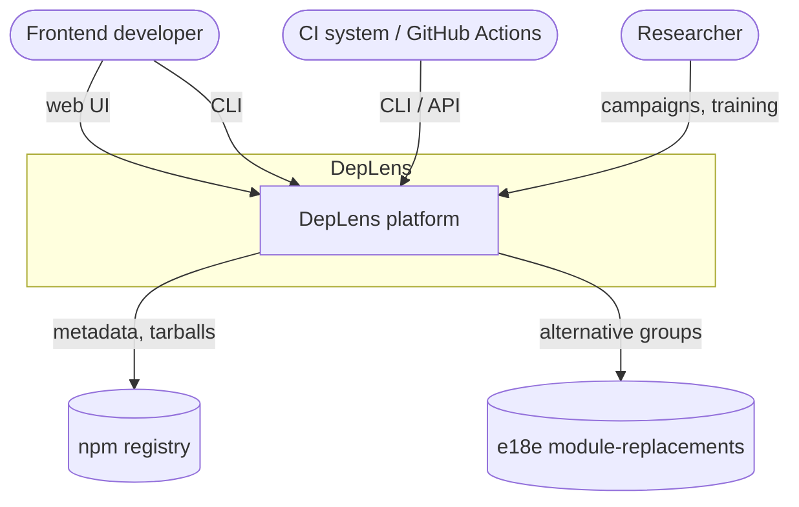
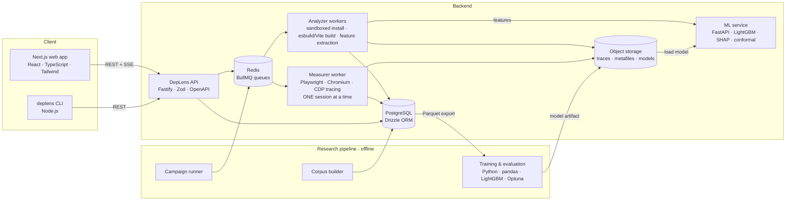
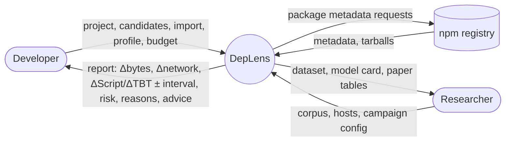
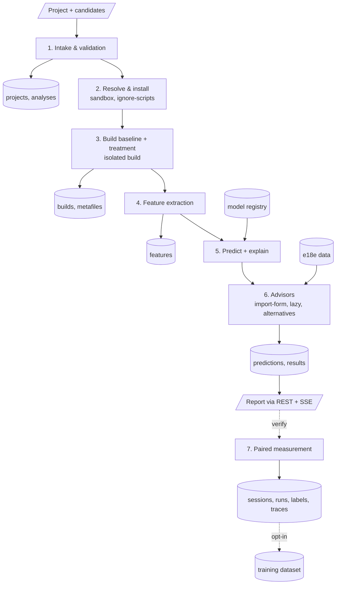
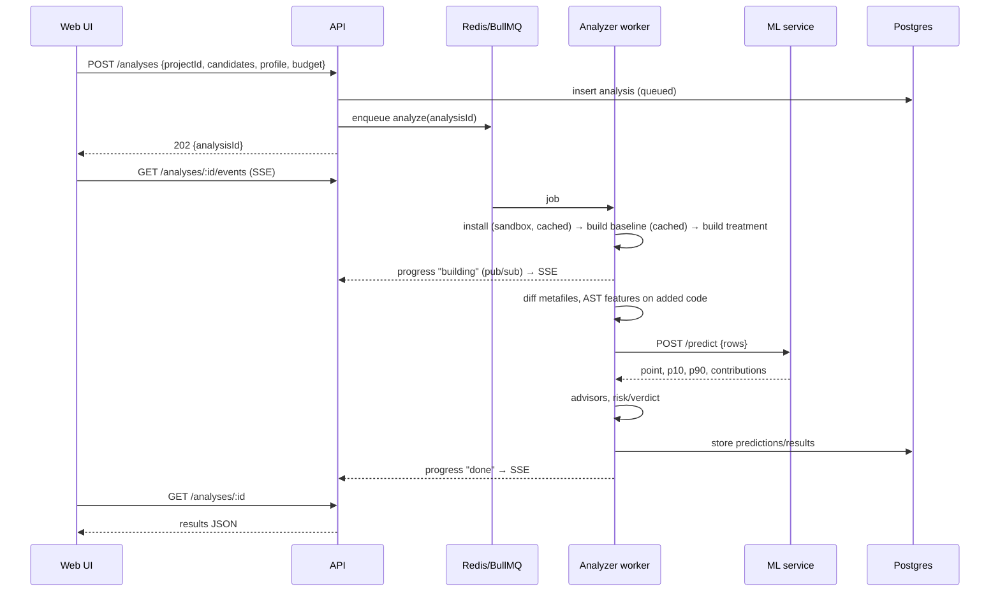
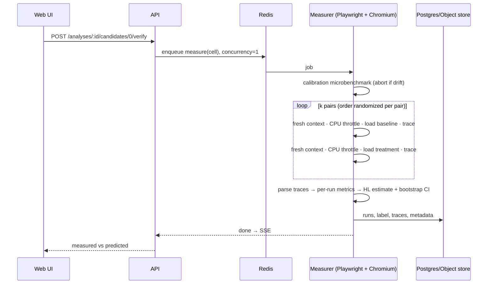
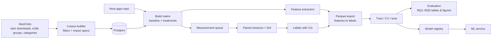
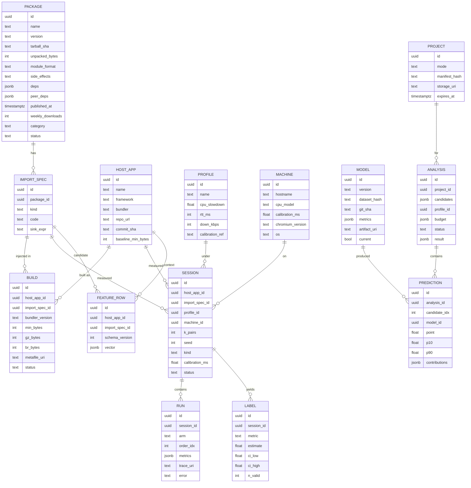
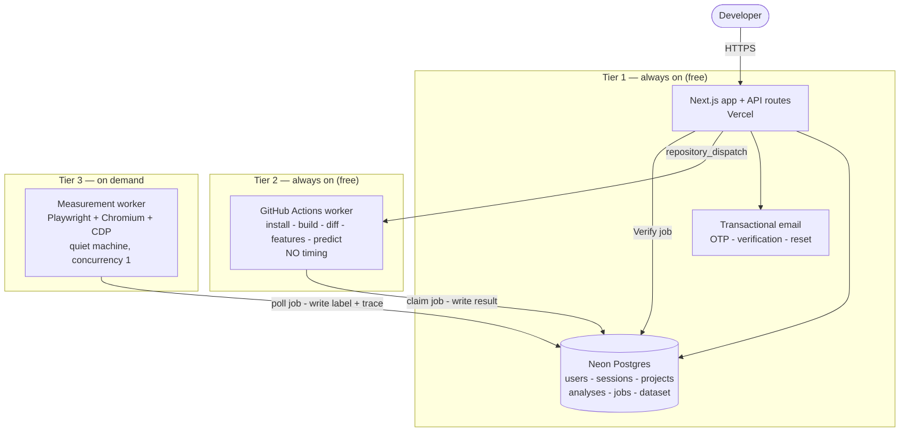

# 06 — System Architecture, Web Stack & Data Flow

## 1. Architecture at a glance

Two systems share one codebase and one database:

1. **Product path (online):** a developer asks "what will this cost?" → build + static features + ML prediction in seconds → optional real measurement.
2. **Research path (offline):** curated packages × host apps → paired measurements → labelled dataset → trained model → deployed to the product path.

The **measurement harness** and the **feature extractor** are shared libraries used by both paths. This guarantees that the features the model is trained on are computed by exactly the same code that computes them for users.

### 1.1 Context diagram (C4 level 1)



### 1.2 Container diagram (C4 level 2)



## 2. Web technology stack (and why each piece is there)

| Layer | Choice | Why this (web-tech course relevance) | Alternatives considered |
|---|---|---|---|
| UI framework | **Next.js (App Router) + React + TypeScript** | SSR/RSC for fast first paint, route handlers for BFF needs, industry standard | Vite + React SPA (simpler; fine too), SvelteKit |
| Styling/UI | **Tailwind CSS + shadcn/ui (Radix primitives)** | Accessible primitives, no heavy component-library runtime (we must be light ourselves — NFR-P5) | MUI (heavier) |
| Charts | **Recharts** or **visx** (forest plots, box plots, stacked bars) | Declarative, SVG, accessible with text fallbacks | ECharts (heavier), Chart.js |
| Code input | **CodeMirror 6** (JS mode) for import specs | Much lighter than Monaco | Monaco |
| Data fetching | **TanStack Query** + **EventSource (SSE)** for job progress | SSE is a simple, HTTP-native push channel; one-way progress is exactly its use case | WebSockets (bidirectional, not needed) |
| Validation | **Zod** shared schemas (UI ↔ API) | Single source of truth, runtime validation + TS types | Yup, Valibot |
| API | **Fastify** (Node 22, TypeScript) + `@fastify/swagger` for **OpenAPI 3.1** | Fast, schema-first REST, generated docs | Express, NestJS, Next route handlers only |
| Jobs | **BullMQ** on **Redis** | Reliable queues, retries, concurrency control (measurer concurrency = 1) | pg-boss (Postgres-only, also fine) |
| DB | **PostgreSQL 16** + **Drizzle ORM** (+ JSONB for feature vectors/metrics) | Relational integrity for experiments; JSONB flexibility | Prisma, SQLite (fine for solo research) |
| Object storage | Local disk in dev → **MinIO** (S3 API) in compose | Traces are large; keep them out of the DB | — |
| Package resolution | **npm registry API**, `pacote`/`npm pack`, lockfile parsers (`@pnpm/lockfile-file`, `@yarnpkg/lockfile`, npm `package-lock` v3 JSON) | Official data; no scraping | Bundlephobia API (rate limits, whole-package only) |
| Bundling | **esbuild** (JS API, `metafile`) for isolated/fast builds; **Vite** (Rollup/Rolldown depending on version) for host builds, plus a tiny `deplens-stats` Vite plugin that dumps chunk→module→renderedLength | esbuild is ms-fast; Vite is what real apps use | webpack (MVP out of scope) |
| Compression | Node `zlib` gzip-9 and brotli-11 | Exact transfer-size deltas | — |
| AST analysis | **oxc-parser** (very fast) or **@babel/parser** + a small visitor | ESTree-compatible; handles modern syntax; run on unminified delta code | acorn + acorn-walk (fine for built output), SWC |
| Browser automation | **Playwright** (Chromium) + **CDP** sessions (`Tracing`, `Emulation.setCPUThrottlingRate`, `Network.emulateNetworkConditions`, `Performance.getMetrics`) | Precise control, pinned browser builds | Puppeteer (estimo uses it), WebPageTest |
| Trace parsing | Own parser for the event buckets (estimo taxonomy) + optionally `@paulirish/trace_engine` (DevTools' trace engine as npm) for FCP/LCP/long tasks | Transparent, testable against golden traces | Lighthouse as a library (heavier, simulated throttling by default) |
| In-page metrics | `PerformanceObserver` (LCP, long tasks), `performance.mark('app-ready')` set by host apps | Standard web performance APIs | web-vitals library |
| Local static server | `sirv` / Node `http` serving the built `dist/` from localhost | Removes network noise from CPU measurements | — |
| ML service | **FastAPI** + **Pydantic** + **LightGBM** (native `pred_contrib` = TreeSHAP) + **MAPIE** or own split-conformal code | Python ML ecosystem; tiny, stateless inference | ONNX in Node (no SHAP), BentoML |
| Training | **Python 3.11 (uv)**, pandas/Polars, scikit-learn, LightGBM, XGBoost (comparison), Optuna, SHAP, SciPy/statsmodels, Matplotlib | Standard, reproducible | — |
| Monorepo | **pnpm workspaces** (+ Turborepo optional) | Shared TS packages | Nx |
| Containers | **Docker Compose** (dev/prod-like); measurer can run on bare metal outside Docker for less noise | One-command setup | Kubernetes (overkill) |
| Testing | Vitest, Playwright Test (UI e2e), pytest | — | Jest |
| CI | GitHub Actions (lint, test, build; never measurement — CI runners are noisy) | — | — |

## 3. Components in detail

### 3.1 Web app (`apps/web`)
Pages: `/` (new analysis), `/analyses/[id]` (results, SSE progress), `/analyses/[id]/compare`, `/verify/[sessionId]`, `/model` (model card), `/explore` (COULD). Server components fetch initial state; client components subscribe to `/events`. Every number rendered with a provenance badge (exact / modeled / predicted / measured).

### 3.2 API (`apps/api`)
Validates input (Zod), stores projects/analyses, enqueues jobs, streams progress (SSE via Redis pub/sub), serves results, rate-limits verification. Stateless; horizontal scaling possible.

### 3.3 Analyzer worker (`services/analyzer`, uses `packages/bundler-kit`, `packages/features`)
1. Materialize project: Quick mode → create a synthetic workspace from lockfile; Full mode → unpack/clone.
2. Install with `--ignore-scripts` (pnpm store cache shared across jobs) inside a sandbox container.
3. **Isolated build:** esbuild bundle of `import-spec + sink` with peers external → iso features.
4. **Context build:** Full mode → Vite build baseline (cached) and treatment; Quick mode → esbuild bundle of the host's *dependency entry points* as a proxy baseline + dedup from lockfile.
5. Diff metafiles → Δbytes, new/shared packages, duplicates; extract the **added code** and run AST features.
6. Call ML service → prediction, interval, contributions → advisors (import-form, lazy, alternatives) → persist → publish progress.

### 3.4 Measurer worker (`services/measurer`, uses `packages/harness`)
Concurrency **1 per machine** (or per pinned core set after A/A validation). Runs calibration, then the paired interleaved session (doc 07), parses traces, computes the HL estimate + bootstrap CI, stores runs/labels/traces.

### 3.5 ML service (`ml/service`)
Loads `model.txt` (LightGBM), `feature_schema.json`, conformal calibration scores and metadata at startup; `/predict` validates schema version, applies the same transforms as training (shared Python module), returns point, interval, contributions. Hot-reload on registry change.

### 3.6 CLI (`apps/cli`)
Runs install/build/feature extraction locally (reuses `bundler-kit` and `features`), sends only the feature vector to `/cli/predict`. `--json` output and budget-based exit codes for CI.

### 3.7 Research pipeline (`research/`)
- `corpus/`: fetch download counts, categories, filters, alternative groups; writes `packages` + `import_specs`.
- `hosts/`: host apps (each with the injection marker and `app-ready` mark) + a checker that builds all hosts and verifies determinism.
- `campaign/`: schedules cells into the measure queue, resumes, triggers A/A sessions, writes daily noise reports.
- `ml/`: dataset export, training, evaluation, paper tables/figures.

## 4. Data flow

### 4.1 DFD level 0



### 4.2 DFD level 1 (product path)



### 4.3 Sequence — one analysis (Full mode)



### 4.4 Sequence — verification



### 4.5 Research data flow



## 5. Repository layout

```
deplens/
├─ CLAUDE.md                     # instructions for Claude Code (read first)
├─ docs/                         # these documents (source of truth for decisions)
├─ apps/
│  ├─ web/                       # Next.js UI
│  ├─ api/                       # Fastify API
│  └─ cli/                       # deplens CLI
├─ services/
│  ├─ analyzer/                  # BullMQ worker: install/build/features/predict
│  └─ measurer/                  # BullMQ worker: paired sessions
├─ packages/
│  ├─ shared/                    # Zod schemas, types, constants (profiles, risk rules)
│  ├─ feature-schema/            # feature-schema.json (+ generated TS types; Python reads the same JSON)
│  ├─ bundler-kit/               # injector, esbuild/Vite builds, metafile diff, compression
│  ├─ features/                  # AST + bundle + metadata feature extractors
│  ├─ harness/                   # measurement harness: session runner, trace parser, stats
│  ├─ lockfile/                  # npm/pnpm/yarn lockfile → dependency graph
│  └─ db/                        # PostgreSQL schema (Drizzle) + migrations — §6
├─ research/
│  ├─ hosts/                     # host apps (each: Vite app + inject marker + app-ready mark)
│  ├─ corpus/                    # corpus builder + seed lists + curated import specs
│  ├─ campaign/                  # campaign runner, A/A scheduler, noise reports
│  └─ fixtures/                  # synthetic calibration packages (work-K, bytes-K, eager-K), lockfile fixtures
├─ ml/
│  ├─ pyproject.toml             # uv-managed
│  ├─ deplens_ml/                # dataset, transforms, models, conformal, evaluation, stats
│  ├─ service/                   # FastAPI app
│  ├─ notebooks/                 # exploration only; results must come from scripts
│  └─ reports/                   # generated tables/figures (git-ignored except final)
├─ infra/
│  ├─ docker-compose.yml         # postgres, redis, minio, api, web, analyzer, ml
│  └─ sandbox/                   # Dockerfile + seccomp/limits for untrusted builds
└─ Makefile                      # dataset, train, eval, paper-tables, up, test
```

## 6. Database schema (ERD)



`SESSION.kind` ∈ {`ab`, `aa`, `iso`} (paired treatment, A/A noise, isolated-on-empty-page).

**Implemented in `packages/db` (P1).** The Drizzle schema adds, beyond the ERD above:
`SESSION.cell_key` (unique per machine — the resume key that stops a restarted campaign from
re-measuring, FR-51), the exact byte deltas and new/shared package lists on `SESSION` (so the B3
baseline needs no joins), `LABEL.within_noise` and `LABEL.baseline_median`, `BUILD.build_key` +
`resolved_deps` + `package_bytes`, `MACHINE.calibration` as the whole rate→ms curve, and
`PREDICTION.verified_session_id` linking a prediction to the session that verified it.
The harness itself does **not** depend on this package: it must be able to measure with nothing but a
disk (`packages/harness/src/store.ts`), and the campaign runner promotes stored sessions into Postgres.

## 7. Deployment

### 7.1 Three tiers (decided 2026-10-02 — see research log)

Timing measurement needs a real browser, arbitrary package installs, and above all a **quiet machine**
(we measured A/A noise of ±4 ms on a busy machine versus ±0.3 ms idle). No free host provides that, so
the system is split by *what kind of number* each tier produces, not by convenience.

| Tier | Runs on | Produces | Up when |
|---|---|---|---|
| **1 — Web app + API** | Vercel free tier (Next.js App Router, Node runtime) + **Neon** free Postgres | Auth, projects, catalogue of already-analysed packages, comparisons, charts, model card, dataset download. Serves stored `exact` / `predicted` numbers. | always |
| **2 — Byte-analysis worker** | **GitHub Actions** (free, unlimited minutes on a public repo), triggered by `repository_dispatch` and a 5-minute cron sweep of the job queue | For a package nobody has analysed: install (`--ignore-scripts`) → build baseline + treatment → **exact Δbytes**, added-code features, and an ML prediction. 1–2 min per job. | always |
| **3 — Measurement worker** | A registered **quiet machine**, started on demand (`pnpm measurer`) | `measured` numbers: the paired A/B Chromium session behind **Verify**, and all dataset collection. Concurrency 1. | when started |

Why tier 2 on shared CI does not break NFR-REP3 / hard rule 1: byte analysis is **deterministic**. The
same build produces the same byte count on a busy runner and an idle one. The rule bans shared machines
for *timing*, and timing lives only in tier 3. Every number in the UI carries the tier that produced it.

This split is also the product thesis: answer instantly from what is known, and spend a real
measurement only on the case too uncertain to decide — the predict-then-verify workflow of RQ4.

### 7.2 Topology



### 7.3 Jobs instead of a queue server

Redis/BullMQ (§2) stays the design for a self-hosted deployment, but the free tiers have no Redis and
the workers are outside the web host. Tier 1 therefore writes a **`job` row** in Postgres and workers
**claim** it with `UPDATE ... SET status='running' WHERE status='queued' ... RETURNING` (a single atomic
statement, so two workers cannot take the same job). Progress is a `job.progress` column the UI polls;
SSE (§2) is used where the worker and API share a process. A job abandoned in `running` for more than
its lease is returned to `queued`, which is also how a crashed campaign resumes (FR-51).

### 7.4 Local development

No Docker or local Postgres is required: dev points `DATABASE_URL` at a **Neon branch** of the same
schema, so dev and production cannot drift. The harness itself needs no database at all — it stores
sessions on disk (`packages/harness/src/store.ts`) — so measurement work continues even with no network.
Emails print to the console in dev instead of being sent.

- Environment variables documented in `.env.example`; secrets never baked into images or committed.

## 8. Authentication & session design (doc 05 §4.5b)

Own implementation, not a third-party identity provider: the mechanisms are what the course requires us
to demonstrate, and hiding them behind OAuth would leave nothing to document or test.

| Concern | Decision | Why |
|---|---|---|
| Password storage | **Argon2id** (memory-hard), per-password salt, parameters recorded | bcrypt is acceptable; Argon2id is the current recommendation and is tunable |
| Session transport | Opaque 256-bit random id in an `httpOnly` + `Secure` + `SameSite=Lax` cookie | The cookie carries **no** user data, so it cannot be read or tampered with client-side |
| Session storage | Server-side `session` row (user, created, last seen, expiry, IP, user-agent) | Enables instant revocation and "log out everywhere" — impossible with a stateless JWT |
| Why not JWT | A signed token cannot be revoked before expiry | Revocation matters more than statelessness at this scale |
| Expiry | 7 days idle, 30 days absolute, rotated on privilege change | Limits damage from a stolen cookie |
| OTP / reset tokens | Random code, stored **hashed**, 10 min / 30 min TTL, single use, attempt-capped | A database leak must not yield usable codes |
| CSRF | Double-submit token on state-changing requests + origin check | `SameSite=Lax` alone does not cover every case |
| CAPTCHA | Challenge on register / login / reset | Verification runs cost real machine time; bots must not queue them |
| Authorization | Role on the user row, checked **server-side in every route handler** | UI-only checks are not security |
| Transport | HTTPS everywhere (Vercel default), HSTS | — |


## 9. Security design (untrusted npm code)

| Threat | Mitigation |
|---|---|
| Malicious install scripts | `--ignore-scripts` always; install inside sandbox container |
| Malicious code at build time (bundler plugins are ours; packages are data) | Bundler never executes package code (esbuild/Rollup parse only). Vite config comes from host apps we control (research) — **for user Full-mode uploads, Vite config executes user code → run the build in the sandbox** |
| Malicious code at runtime in the browser | Headless Chromium in a container, no credentials, egress blocked during measurement, fresh profile per run |
| Resource exhaustion | CPU/mem/pids/time limits; archive size and file-count caps; zip-slip guard |
| Data leakage of user projects | 24 h retention; Quick mode/CLI avoid uploading source |

## 10. Key design decisions (ADR summary)

1. **Predict from build outputs, not only package metadata** — exact in-context Δbytes is cheap and is the strongest baseline; ignoring it would make the model look better than it is against weak baselines.
2. **Delta measurement, not attribution** — we measure whole-page cost with and without the import instead of attributing trace events to package URLs, because bundling merges package code into app chunks.
3. **Paired interleaved sessions + A/A** — to make labels trustworthy and noise explicit.
4. **One shared feature library** for training and serving — avoids train/serve skew.
5. **GBDT, not deep learning** — tabular data of a few thousand rows; interpretable; fast.
6. **SSE over WebSockets** — progress is one-way.
7. **Measurer outside Docker on a quiet machine** — container overhead is small, but noisy neighbours are not; validated via A/A.
