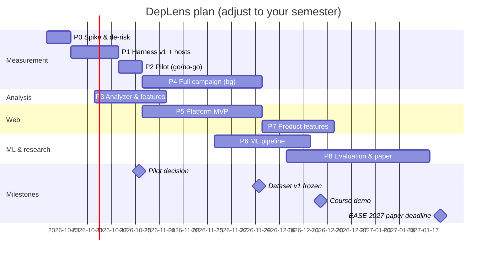

# 09 — Phases, Roadmap & Risk Plan

Assumptions (adjust to your reality): team of 3–4, ~12–15 h/week each, start **Tue 29 Sep 2026**, course demo around **mid-December 2026**, paper submission **Jan–Feb 2027**. I don't know your course deadline — shift the calendar, keep the order.

## 1. Guiding principles
1. **De-risk the measurement first.** The model is only as good as the labels. Nothing else matters until the harness passes the injected-cost test (doc 07 §8).
2. **Pilot before scale.** A 2-week pilot answers RQ1/RQ2 and decides the paper's framing before you invest in 5,000 cells.
3. **Run the campaign in the background.** Measurement is machine time, not people time — start it as early as possible and build the product while it runs.
4. **Deterministic before learned.** Ship exact Δbytes and advisors first; the ML layer sits on top.
5. **Every phase ends with an exit check.** If it fails, stop and fix, don't push on.

## 2. Roles
| Role | Owns | Phase focus |
|---|---|---|
| **Measurement lead** | harness, host apps, campaigns, noise reports | P0–P4 |
| **Analysis lead** | bundler-kit, feature extraction, corpus | P2–P4 |
| **Web lead** | API, workers, web UI, CLI | P5, P7 |
| **ML & research lead** | dataset, models, evaluation, statistics, paper | P4, P6, P8 |
With 3 people, merge Analysis into Measurement + Web.

## 3. Phases

### P0 — Foundations & de-risking spike · Week 1 (29 Sep – 5 Oct)
- Monorepo scaffold (pnpm workspaces, TS strict, lint, Vitest), `CLAUDE.md`, docs in repo.
- Harness spike: 1 vanilla host, injector, esbuild/Vite build, Playwright + CDP trace, bucket parser, paired session, HL + bootstrap.
- Synthetic calibration packages `work-K`, `bytes-K`, `eager-K` (`research/fixtures/generate.mjs`).
- **Experiments:** A/A noise on the chosen machine; injected-cost test; **throttling behaviour (dur vs tdur at 1× vs 4×)** — doc 07 §4.7.
- **Exit:** work-K recovered linearly (R² ≥ 0.97) with 4×/1× slope ratio ≈ 4; A/A MDE known; dur/tdur decision logged in `docs/research-log.md`.
- ✅ **Status 28 Sep 2026:** done on the build container (see research log) — R² 0.989 (1×) / 0.972 (4×), slope ratio 3.99 for thread time. **Repeat on the dedicated measurement machine** before P1 data collection.

### P1 — Measurement harness v1 + host apps · Weeks 2–3 (6 – 19 Oct)
- Harness hardening: calibration & drift abort, failure handling, trace storage, session metadata, CLI `harness run`.
- Host apps: 6 Vite templates (vanilla, React, Vue, Svelte, Preact, Solid) + first 2 realistic hosts (e.g., Conduit React/Vue if they build) + 1 synthetic heavy React host. Each with inject marker, `app-ready` mark, mocked data, deterministic render.
- Postgres schema (Drizzle) for packages/hosts/sessions/runs/labels.
- **Exit:** all hosts build deterministically; A/A 95% CI covers 0 in ≥ 90% of sessions; one 10-pair session ≤ 90 s on small hosts.

**Status 1 Oct 2026** (details in `docs/research-log.md`):
| P1 item | State |
|---|---|
| Vite builder + `deplens-stats` plugin | ✅ `packages/harness/src/viteBuild.ts`, `bundleStats.ts`; both bundlers share one `BuildResult` |
| Host apps — 8 (`empty`, `vanilla`, `react`, `vue`, `svelte`, `preact`, `solid`, `react-heavy`) | ✅ all pass the contract check and build deterministically |
| Host apps — 2 realistic OSS hosts (Conduit-style) | ⏳ not started; the only P1 item left on hosts (risk R5) |
| Profiles from a measured calibration curve | ✅ `profiles.ts` + `machine.ts`; rate is interpolated per machine |
| Calibration & drift abort (FR-33) | ✅ verified in anger — refused a session that started 108% slow |
| Invalid-cell detection (FR-34) | ✅ `checkValidity`: zero-byte delta, package absent, lazy not split |
| Trace storage + session metadata (FR-35) | ✅ `--traces`; sessions stored as JSON + append-only index (resume key per cell) |
| Postgres schema (Drizzle) | ✅ `packages/db` — 14 tables from doc 06 §6, migration generated |
| Unit tests | ✅ 47 passing (was 15) |
| **Exit: deterministic builds** | ✅ 8/8 hosts |
| **Exit: 10-pair session ≤ 90 s** | ✅ 38–40 s on small hosts |
| **Exit: A/A CI covers 0 in ≥ 90% of sessions** | ❌ **blocked** — needs ≥ 10 A/A sessions per host on a quiet machine. Early signal is good: 3/3 A/A sessions cover 0 with MDE₉₅ ≈ 1.3 ms when the dev laptop is idle, but it is unusable under load |

### P2 — Pilot study (RQ1/RQ2 go/no-go) · Week 4 (20 – 26 Oct)
- 40 packages (≥ 6 alternative groups) × 2 scenarios × 4 hosts × 1 profile ≈ 250–320 cells + isolated sessions.
- Analyses: size proxies vs ΔScript (RQ2); context effect ΔC − C_iso incl. a React component lib in React vs vanilla hosts (RQ1); noise per host.
- **Decision gate (write it down):**
  - If in-context Δbytes already gives ρ > 0.95 and R² > 0.9 for ΔScript → model headroom is small; re-frame toward "size vs runtime" empirical paper + ΔTBT/context story.
  - If context effect is negligible everywhere → drop "context-aware" from the headline, keep import-aware runtime prediction.
  - Otherwise → proceed as planned.

### P3 — Static analyzer & features · Weeks 3–5 (13 Oct – 2 Nov), parallel with P1/P2
- `packages/lockfile` (npm v3, pnpm, yarn) → dependency graph.
- `packages/bundler-kit`: isolated esbuild builds, Vite host builds with `deplens-stats` plugin, metafile diff, gzip/brotli, added-code extraction.
- `packages/features`: G1–G5 extractors from `feature-schema.json`; unit tests with fixtures.
- **Exit:** features for all pilot cells; extractor ≤ 5 s per cell (excluding install); schema contract test TS ↔ Python passes.

### P4 — Corpus & full data collection · Weeks 5–9 (27 Oct – 30 Nov), background
- Corpus builder with inclusion/exclusion reasons; curated typical imports (LLM-assisted drafting is fine, **human-verified**); alternative groups.
- Campaign runner (resume, A/A per day, noise report) → run nights/weekends.
- Secondary-profile subset; isolated sessions; (optional) real-phone subset.
- **Exit:** ≥ 2,000 valid cells (target 5,000); A/A stable across days; dataset v1 exported with hash + data dictionary.

### P5 — Web platform MVP · Weeks 5–9 (27 Oct – 30 Nov), parallel
- API (Fastify, Zod, OpenAPI), BullMQ queues, analyzer worker, SSE progress.
- UI: New Analysis (Quick + Full), Results cards with provenance badges, Compare view (forest plot). Initially wired to **B3 (in-context bytes) baseline** as a placeholder predictor so the product works before ML is ready.
- Sandbox container for untrusted installs/builds.
- **Exit:** end-to-end analysis on 3 fixture projects; malicious-postinstall test passes; NFR-P1/P2 measured.

### P6 — ML pipeline · Weeks 8–11 (17 Nov – 14 Dec)
- Dataset loader, transforms, baselines B0–B4, M1/M2, Optuna nested grouped CV, conformal intervals, TreeSHAP, ablations, statistics.
- FastAPI ML service + model registry; swap the placeholder predictor.
- **Exit:** full S2/S3/S4 results table with CIs and Wilcoxon/Holm tests; interval coverage within ±5 pts; model card generated.

### P7 — Product features & integration · Weeks 10–12 (1 – 21 Dec)
- Verify flow (measurer worker, concurrency 1) + measured-vs-predicted view.
- Advisors: import-form, e18e alternatives, (COULD) lazy what-if.
- CLI (`check`, `compare`, `--json`, exit codes); model card page.
- (COULD) GitHub Action PR comment.
- **Course demo** ≈ end of Week 11/12.
- **Exit:** all MUST features + Verify + CLI working; usability hallway test (5 people).

### P8 — Evaluation, paper & artifact · Weeks 11–16 (8 Dec – 18 Jan)
- RQ1–RQ5 final runs on frozen dataset; predict-then-verify curve; qualitative case studies (small-but-expensive, large-but-cheap packages).
- (Optional) mini user study: 8–12 developers pick among alternatives with vs without DepLens (decision quality + time + trust), 30 min each.
- Paper writing (doc 11), threats to validity, artifact on Zenodo (DOI), repo tagged.
- **Exit:** paper draft reviewed internally twice; `make paper-tables` reproduces every number.

## 4. Gantt

## 5. Publication calendar (verified 28 Sep 2026 — re-check CFPs)

| Venue | Publisher | Fit | Deadline(s) | Realistic for us? |
|---|---|---|---|---|
| **ICWE 2027** (Int. Conf. on Web Engineering) | **Springer LNCS** | Excellent: performance of web apps, ML for web engineering, datasets/empirical studies of web tech | 2027 CFP not yet published. ICWE 2026: abstract 6 Feb, paper 20 Feb 2026; full paper 15 pp LNCS, NIER 8 pp; in-person presentation required | **Primary target** (expect ~Feb 2027) |
| **EASE 2027** (Evaluation & Assessment in SE), Hanoi, 15–18 Jun 2027 | ACM | Good: empirical rigor | abstract **15 Jan 2027**, paper **22 Jan 2027** | **Backup / earlier option** |
| **AIPerf 2027** workshop @ ICSE 2027 (AI for software performance), Dublin | ICSE workshop proceedings | Excellent topic fit | **13 Nov 2026** | Only with pilot results; mind prior-publication rules for the later full paper |
| **ICPE 2027** research track, Gothenburg, May 2027 | ACM/SPEC | Excellent topic fit (performance modelling/prediction/measurement) | abstract 9 Nov, paper **16 Nov 2026** | Too early for full results; watch **Data Challenge / Emerging Research / Posters & Demos** tracks (dates TBA) |
| MSR 2027 Data & Tool Showcase | IEEE/ACM | Dataset paper | abstract 5 Nov, paper 10 Nov 2026 | Too early; target MSR 2028 for an extended dataset |
| SANER 2027 ERA / short / tool demo | IEEE | Good | abstract 19 Oct, paper 23 Oct 2026 | Too early |
| Other IEEE options (COMPSAC, QRS, SEAA/Euromicro, APSEC) | IEEE | Moderate | typically Jan–Jul — **check CFPs** | Fallbacks |

⚠️ **Avoid look-alike predatory "conferences".** Search results for "International Conference on Web Engineering" include WASET events (waset.org) and "congress" events promising Google-Scholar indexing — these are **not** the real ICWE. The real ICWE is at `icwe20XX.webengineering.org` and is published in Springer LNCS. Check the CORE portal ranking and the publisher's proceedings page before submitting anywhere.

## 6. Risk register

| # | Risk | Likelihood | Impact | Early signal | Mitigation |
|---|---|---|---|---|---|
| R1 | Measurement noise too high to label small costs | Medium | High | A/A MDE > 5 ms at the primary profile | quieter machine; tdur-based CPU labels at 1× + projection; more pairs; focus claims on material costs |
| R2 | Context effect small → headline weakens | Medium | Medium | Pilot RQ1 | re-frame (doc 08 §13); ΔTBT and shared-dependency cases still show context |
| R3 | ML does not beat in-context bytes (B3) | Medium | Medium | Pilot residual analysis | still publish RQ1/RQ2 + tool; emphasize decisions & uncertainty |
| R4 | Campaign takes longer than planned | High | Medium | Session time in P1 | start early; prune hosts/scenarios; second machine with cross-machine subset |
| R5 | Host apps (Conduit/TodoMVC) don't build | Medium | Low | P1 | replace with other Vite OSS apps or synthetic realistic hosts |
| R6 | Corpus curation labor (typical imports) | High | Medium | P4 | LLM-drafted imports + human verification; limit to 2 scenarios |
| R7 | Security incident from untrusted packages | Low | High | — | sandbox, ignore-scripts, no secrets, egress rules |
| R8 | Team bandwidth / exams | High | Medium | missed exit checks | MUST-only scope; product uses B3 placeholder until ML is ready |
| R9 | Lab ≠ real devices (reviewer objection) | High | Medium | — | calibration; 1-phone validation subset; clear threats-to-validity |
| R10 | "Why not just measure?" objection | Certain | High | — | predict-then-verify savings curve (RQ4); cost/latency comparison table |

## 7. Definition of done (project level)
- [ ] Harness validation tests pass and are in CI (except timing-sensitive ones, run on the measurement machine).
- [ ] Dataset v1 frozen with hash, data dictionary, reproducibility checklist.
- [ ] Model card with S2/S3/S4 metrics and CIs; interval coverage verified.
- [ ] Web app + CLI demo with all MUST features and Verify.
- [ ] `make paper-tables` reproduces the paper.
- [ ] Artifact archived (Zenodo DOI), README with one-command setup.
